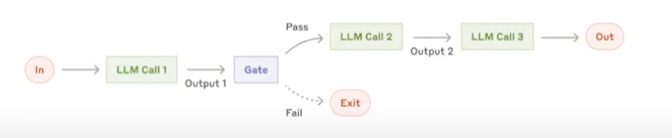
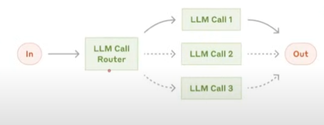
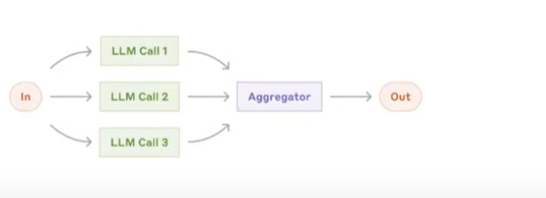
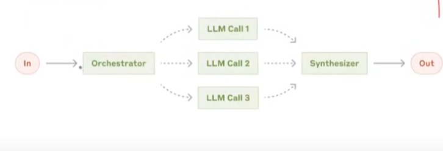
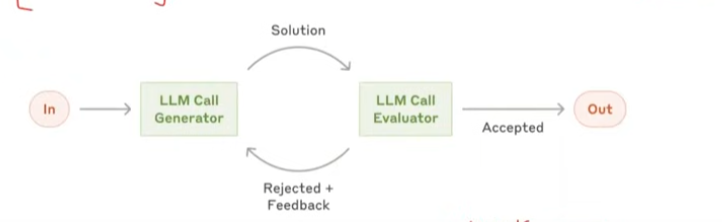

# LLMWorkflows
1. LLM workflows are a step by step process using which we can build complex LLM applications.
2. Each step in a workflow performs a distinct task - such as prompting, reasoning, tool calling, memory access, or decision-making.
3. Workflows can be linear, parallel, branched, or looped, allowing for complex behaviours like retries, multi-agent communication, or tool-augmented reasoning.
4. Common workflows

## Prompt Chaining
Connecting multiple prompts so the output of one becomes the input of the next.
 - Talk with LLM multiple times in series or sequence
 

 ## Routing
 Dynamically choosing which model, tool, or path to follow based on conditions or input.
- Understan task and decide which LLM will execute it
 

## Parallelization
Running multiple tasks or model calls at the same time to save time.
- execute task in parallel : task->subtask
- we know nature of LLM in advance (which LLM is used for which task)

## Orchestrator Workers
A controller (orchestrator) assigns and coordinates tasks handled by specialized workers.
- execute task in parallel : task->subtask
- the nature of LLM decide dynamically 

## Evaluator Optimizer
A feedback loop that checks outputs and improves prompts, models, or workflow steps.

