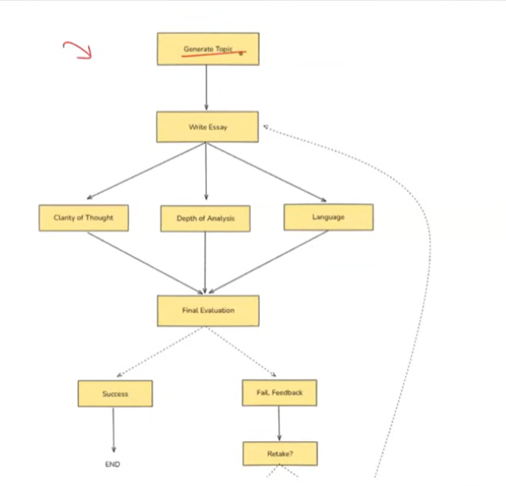

# Graphs, Nodes, Edges (represent workflow in graph)
## Example
The system generates an essay topic, collects the student's submission, and evaluates it in parallel on depth of analysis, language quality, and clarity of thought. Based on the combined score, it either gives feedback for improvement or approves the essay.

1. Generate Topic

System generates a relevant UPSC-style essay topic and presents it to the student.

2. CollectEssay

Student writes and submits the essay based on the generated topic.

3. Evaluate Essay (Parallel Evaluation Block)

Three evaluation tasks run in parallel:
- EvaluateDepth-Analyzes depth of analysis, argument strength, and critical thinking.
- EvaluateLanguage-Checks grammar, vocabulary, fluency, and tone.
- EvaluateClarity-Assesses coherence, logical flow, and clarity of thought.

4. AggregateResults

Combines the three scores and generates a total score (e.g., out of 15).

5. Conditional Routing

Based on the total score:
- If score meets threshold go to ShowSuccess
- If score is below threshold go to GiveFeedback

6. GiveFeedback
Provides targeted suggestions for improvement in weak areas.

7. CollectRevision (optional loop)

- Student resubmits the revised essay.
- Loop back to EvaluateEssay

8. ShowSuccess
Congratulates the student and ends the flow.

