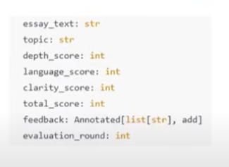

# State

In LangGraph, state is the shared memory that flows through your workflow - it holds all the data being passed between nodes as your graph runs.

In LangGraph, the state is the shared memory that flows through the graph, carrying inputs, intermediate results, and outputs between nodes.

Think of it like a backpack that each node can read from, update, or add to as the workflow progresses.

Example: If your state starts with a user query, one node might add retrieved documents, another might add model responses, and the final node produces the answer — all stored in the evolving state object.

- all nodes has access of state
- state are shared and mutable
- state is special dictionary can me type dictionary or pydantic
