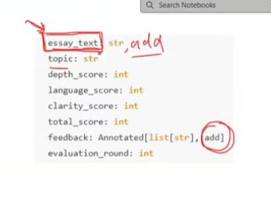

# Reducers

Reducers in LangGraph define how updates from nodes are applied to the shared state.
Each key in the state can have its own reducer, which determines whether new data replaces, merges, or adds to the existing value.

- multiple node can update same value
- reducers tells what will be state update

